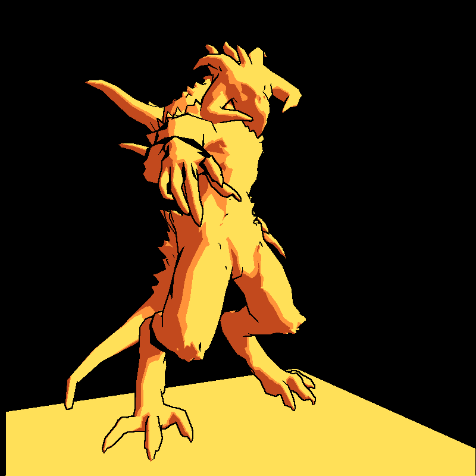
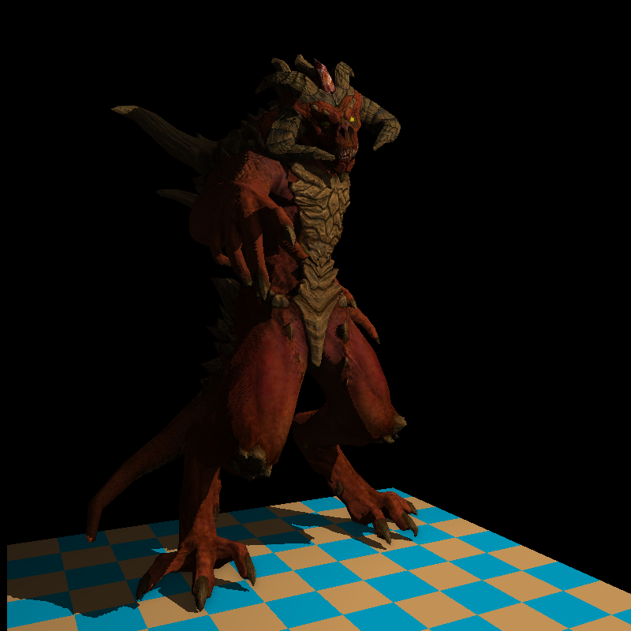
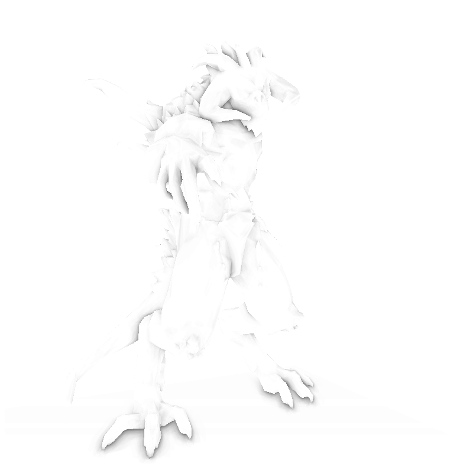
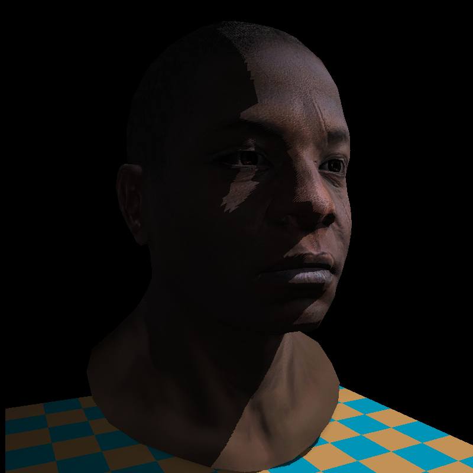
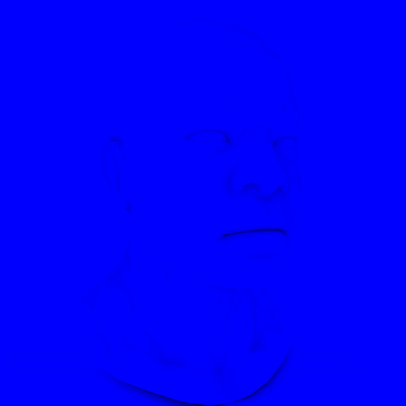
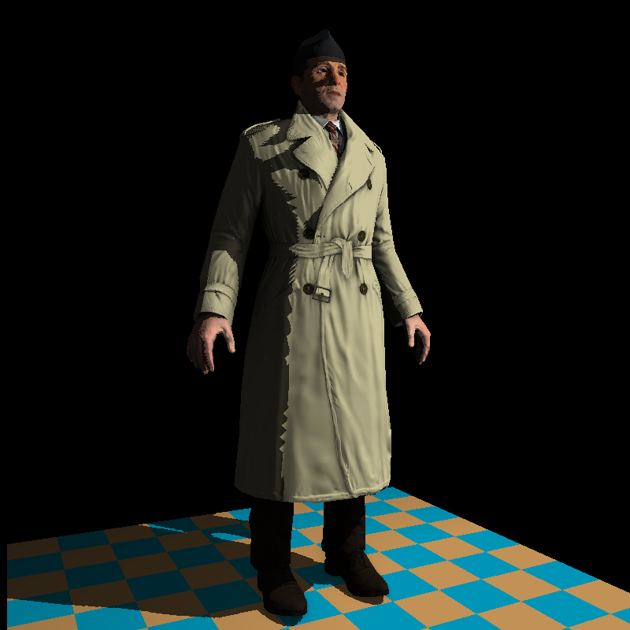
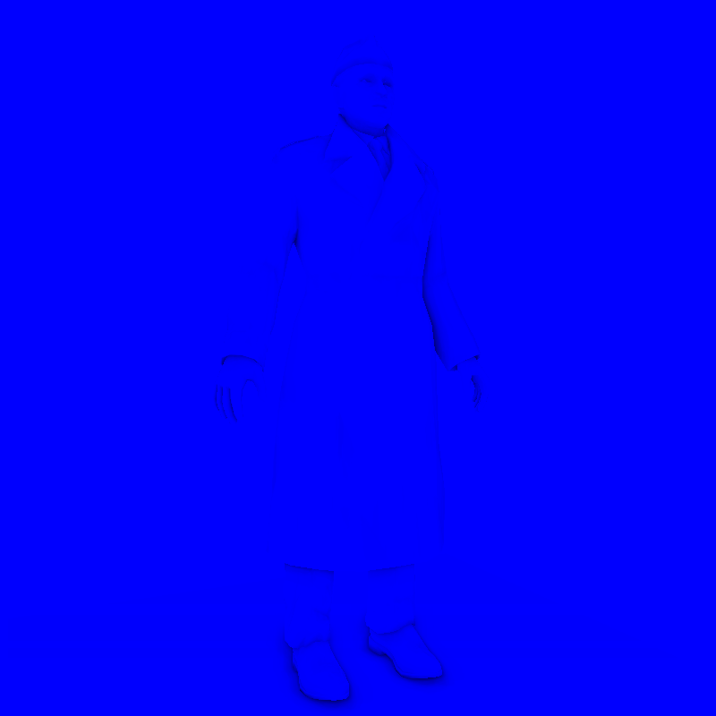

# TinyRenderer

一个使用 C++ 从零实现的软件光栅化渲染器，用于学习现代渲染管线中的核心原理。项目仍在持续开发中。

## 当前实现

- OBJ 模型及顶点、UV、法线数据加载
- LookAt 相机、透视投影与视口变换
- 基于重心坐标的三角形光栅化
- 基于 `1/w` 权重修正的透视正确插值
- 背面剔除与 Z-Buffer 深度测试
- Diffuse 漫反射纹理采样
- Phong 环境光、漫反射与镜面反射
- Specular 镜面贴图
- 切线空间 TBN 矩阵与 Normal Mapping
- Shadow Mapping（光源深度图、深度偏移与阴影测试）
- Screen-Space Ambient Occlusion（观察空间位置重建、法线半球采样与距离衰减）
- Toon Shading（离散光照色阶与基于深度缓冲的 Sobel 轮廓检测）
- 可编程 Vertex/Fragment Shader 风格接口

## 渲染结果

以下结果展示了纹理、法线贴图、Phong 光照、透视正确插值和实时阴影效果。

| Diablo III | Boggie | African Head |
|:---:|:---:|:---:|
|  |  |  |

### Toon Shading

当前 ToonShader 将环境光与漫反射光照量化为三个离散色阶，并对相机 Z-Buffer 应用 Sobel 算子检测深度突变，以黑色轮廓强化卡通渲染效果。

<p align="center">
  
</p>

### Screen-Space Ambient Occlusion

当前 SSAO 实现先通过 Normal/Depth Pass 生成观察空间法线与主相机深度缓冲，再从屏幕坐标重建观察空间位置。每个可见像素使用沿表面法线旋转的 `+z` 半球 kernel 进行采样，并通过深度偏移和距离权重减少自遮挡及远距离表面造成的黑边。计算得到的 AO 可见度只调制 Phong 光照中的环境光项，不会直接压暗漫反射和镜面反射。

AO buffer 中白色表示环境光基本不受遮挡，较暗区域表示褶皱、凹槽、模型交界处或接触面存在更强的环境光遮蔽。当前结果使用原始 SSAO buffer，尚未加入双边滤波。

#### Diablo III

| SSAO 渲染结果 | SSAO Buffer |
|:---:|:---:|
|  |  |

#### African Head

| SSAO 渲染结果 | SSAO Buffer |
|:---:|:---:|
|  |  |

#### Boggie

| SSAO 渲染结果 | SSAO Buffer |
|:---:|:---:|
|  |  |

## 构建与运行

需要支持 C++20 的编译器和 CMake 3.12 或更高版本。

```bash
cmake -S . -B build
cmake --build build
```

不传参数时默认渲染 Diablo 模型：

```bash
./build/tinyrenderer
```

也可以传入一个或多个 OBJ 文件：

```bash
./build/tinyrenderer obj/african_head/african_head.obj
```

最终渲染、观察空间法线和 SSAO 可见度将分别保存为项目目录下的 `framebuffer.tga`、`normalbuffer.tga` 和 `ssao.tga`。

## 后续计划

项目会持续更新，逐步加入 SSAO 双边滤波、更多光照模型、抗锯齿和渲染效果。
