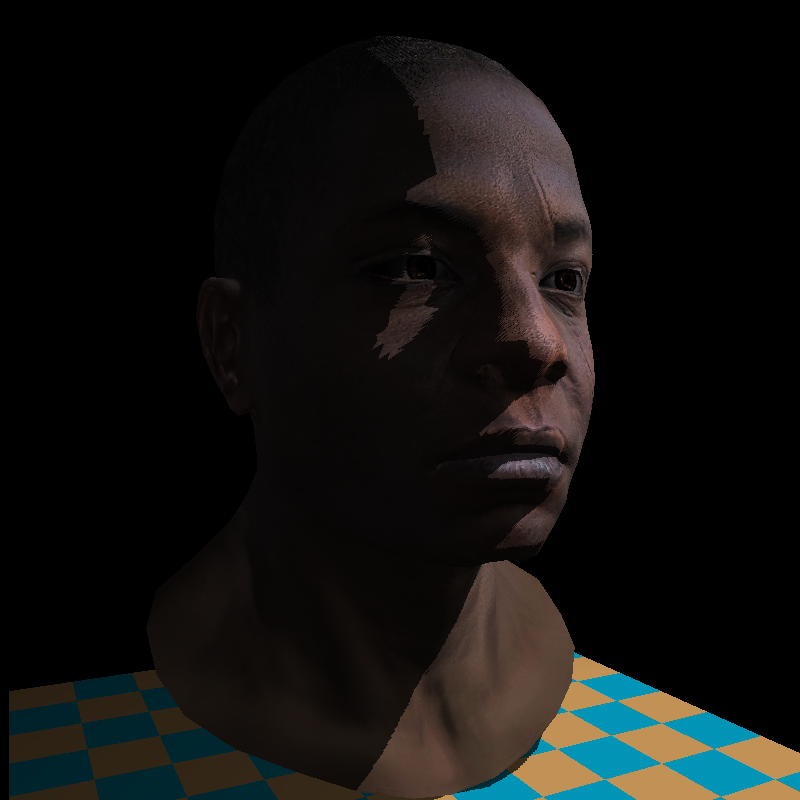

# TinyRenderer

一个使用 C++ 从零实现的软件光栅化渲染器，用于学习现代渲染管线中的核心原理。项目仍在持续开发中。

## 当前实现

- OBJ 模型及顶点、UV、法线数据加载
- LookAt 相机、透视投影与视口变换
- 基于重心坐标的三角形光栅化
- 基于 `1/w` 权重修正的透视正确插值
- 背面剔除与 Z-Buffer 深度测试
- Diffuse 漫反射纹理采样
- Phong 环境光、漫反射与镜面反射
- Specular 镜面贴图
- 切线空间 TBN 矩阵与 Normal Mapping
- Shadow Mapping（光源深度图、深度偏移与阴影测试）
- 可编程 Vertex/Fragment Shader 风格接口

## 渲染结果

以下结果展示了纹理、法线贴图、Phong 光照、透视正确插值和实时阴影效果。

| Diablo III | Boggie | African Head |
|:---:|:---:|:---:|
|  |  |  |

## 构建与运行

需要支持 C++20 的编译器和 CMake 3.12 或更高版本。

```bash
cmake -S . -B build
cmake --build build
```

不传参数时默认渲染 Diablo 模型：

```bash
./build/tinyrenderer
```

也可以传入一个或多个 OBJ 文件：

```bash
./build/tinyrenderer obj/african_head/african_head.obj
```

渲染结果将保存为项目目录下的 `framebuffer.tga`。

## 后续计划

项目会持续更新，逐步加入更多光照模型、抗锯齿和渲染效果。
